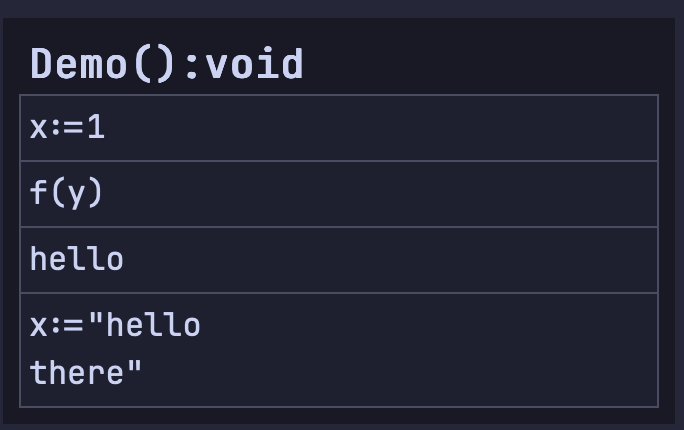
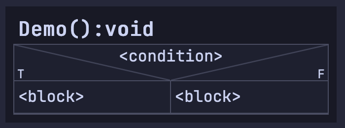
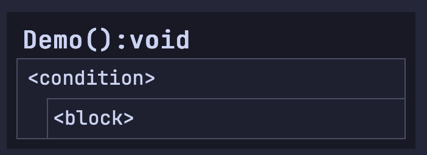
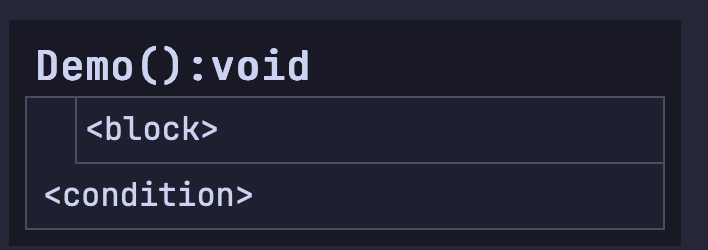
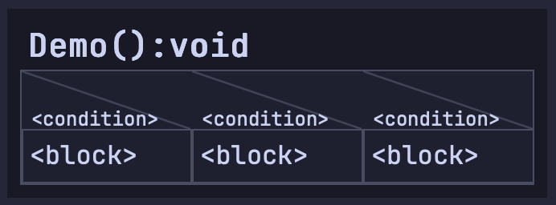
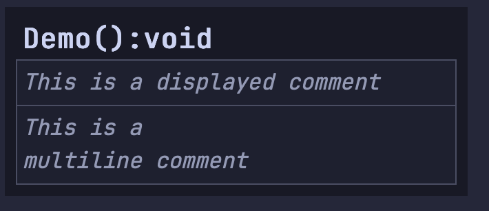
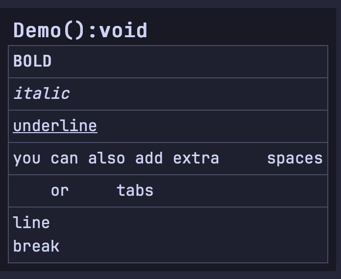

# Structogram viewer
## Demo
*Starting the program:*
 <br><br><hr>
*Instant updates when saving file*


## Usage
### Dependencies:
```sh
python3 pip install pywebview
```
### Run project
```sh
python3 main.py (path-to-structogram)
```

## Pseudo-code specifications
>The `stukis/demo/demo.stuki` file contains a demo code that contains all language features.

Note: White spaces are ignored.

---
### caption
Set the caption of the structogram
```
caption <caption>
```

---
### statements
```
x:=1
f(y)
hello
[
    x:="hello
    there"
]
```
<br>
Basically anything that is not something else

---
### if-else
```
if <condition>
    <block>
else
    <block>
end
```
<br>

---
### while
```
while <condition>
    <block>
end
```
<br>

---
### do-while
```
do
    <block>
while <condition>
```
<br>

---
### switch-case
```
switch
    case <condition>
        <block>
    case <condition>
        <block>
    case <condition>
        <block>
    ...
end
```
<br>


---
### comments
```
# Code-only comment
// This is a displayed comment
/*
This is a
multiline comment
*/
```
<br>

### statement text formatting
```
§* BOLD *§
§# italic #§
§_ underline _§
you can also add extra §s §s  spaces
§t §t or §t §t tabs
line §n break
```
<br>